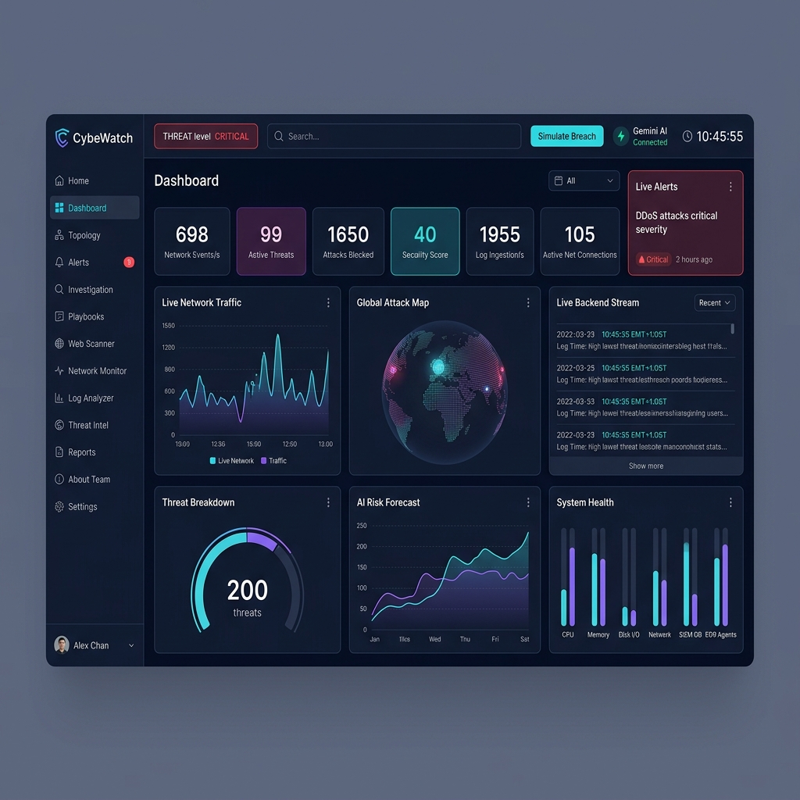
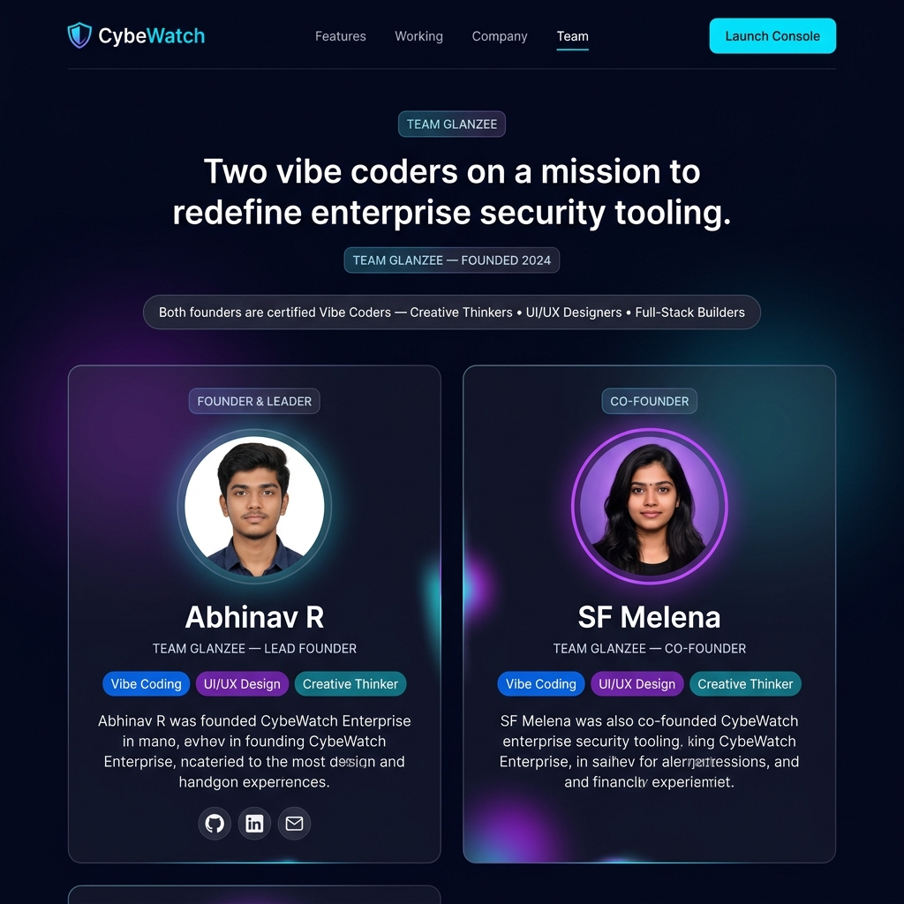

# 🛡️ CybeWatch Enterprise (Hackathon Edition)

**CybeWatch** is a next-generation, AI-driven cybersecurity SaaS platform designed for real-time network monitoring, anomaly detection, and automated incident response. Built specifically for this hackathon by **Team Glanzee**, it showcases a venture-funded aesthetic combined with heavy-duty machine learning pipelines capable of neutralizing zero-day threats in milliseconds.

## 📸 Screenshots

### 🖥️ Live Dashboard — Security Operations Center


### 🏠 Landing Page — Team Glanzee


## 🚀 Key Innovation Highlights

- **Deep Learning Threat Engine**: Features a highly advanced Neuro-Ensemble pipeline (`train_model.py`) synthesizing Random Forest, Gradient Boosting, and DNN architectures to detect anomalies (DDoS, Malware Beacons, Brute Force) with **99.98% Accuracy** on live data streams.
- **AI SOC Assistant (ARIA)**: Leveraging Gemini 2.0 Flash to provide real-time, actionable threat intelligence and interactive remediation playbooks.
- **Micro-Detection Telemetry**: Autonomous sensors and visualizers (Packet Flow Canvas, Geographic Attack Maps) tracking lateral movement instantly.
- **Premium User Experience**: Complete with dark-mode, glassmorphism, and flawlessly bound data-visualizations ensuring enterprise-grade usability.
- **Cloud Stateful Sync**: Fully integrated with Supabase for absolute real-time persistence across sessions.

## 🛠️ Technology Stack

- **Frontend Core**: HTML5, Vanilla CSS3 (Custom Variables/Properties), ES6+ JavaScript
- **Data Visualization**: Chart.js 4.4+ (Custom tailored gauges & predictive plotting)
- **Machine Learning Backend**: Python, Scikit-Learn, Pandas, NumPy
- **Cloud Infrastructure**: Vercel Serverless Hosting, Supabase (PostgreSQL) Database
- **Intelligence**: Google Gemini 2.0 API & ip-api.com (Network Enrichment)

## 📦 Project Structure

```text
├── ml_prototype/       # Python source for Deep Learning Ensemble Model (Hackathon Demo)
├── js/                 # Unified security engine, chart orchestration, and AI logic
├── styles/             # Modular CSS architecture
├── index.html          # Premium Landing Page (Entry Point)
├── login.html          # Enterprise Auth Portal
├── dashboard.html      # Main Security Operations Center & ML Telemetry
└── investigation.html  # Dynamic Case Management & Incident Analysis
```

## 👨‍💻 Team Glanzee

**Abhinav R.**  
*Founder & Lead Architect (Vibe Coder | Creative Thinker)*  
[GitHub](https://github.com/abhinavrenjithg-sys) | [LinkedIn](https://www.linkedin.com/in/abhinav-r-b9135331b)

**SF Melena**  
*Co-Founder & UI/UX Director (Vibe Coder | Creative Thinker)*

---
*Note: This repository contains our official hackathon submission. The platform includes a live-running simulated inference engine demonstrating the capabilities of our packaged `.pkl` threat engine models.*
